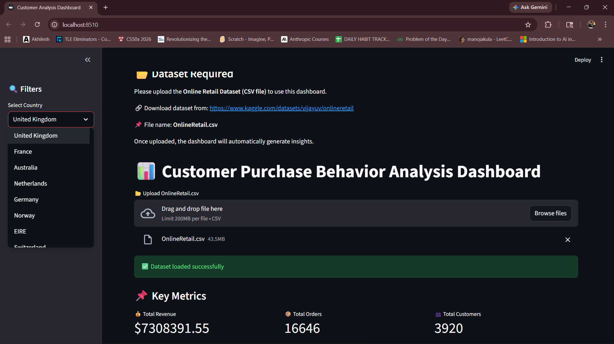
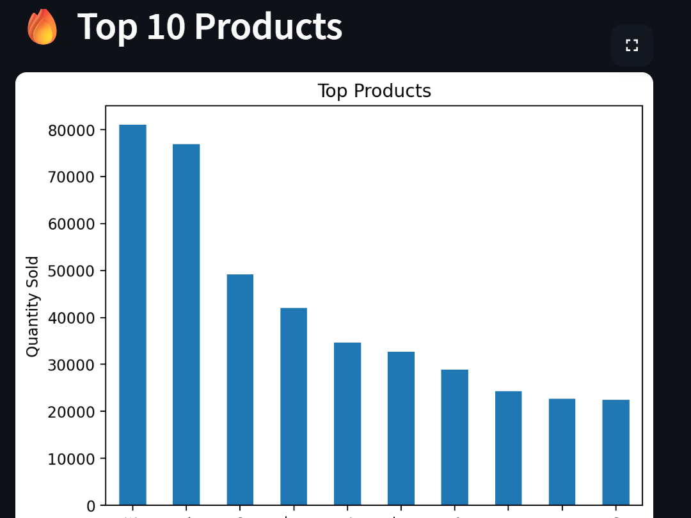
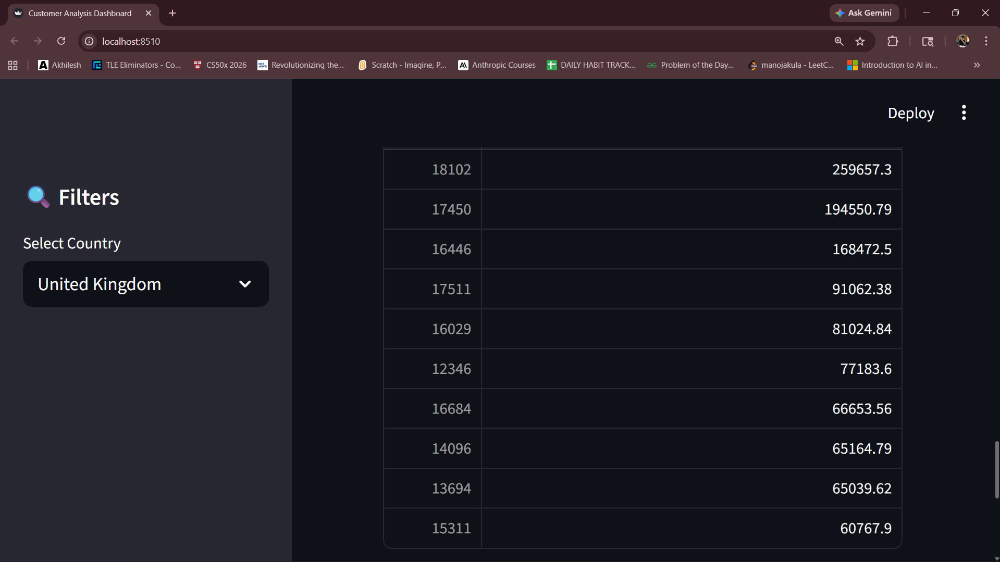

# 📊 Customer Purchase Behavior Analysis Dashboard

## 🚀 Overview
An interactive data analysis dashboard built using **Streamlit** to analyze customer purchasing behavior and sales trends from real-world e-commerce data.

This project helps identify key business insights such as top products, high-value customers, and revenue patterns.

---

## 🛠 Tech Stack
- Python  
- Pandas  
- Matplotlib  
- Streamlit  

---

## 📂 Dataset

Download the dataset from:  
https://www.kaggle.com/datasets/vijayuv/onlineretail  

File used:  
**OnlineRetail.csv**

---

## 📊 Features
- Top-selling products analysis  
- Revenue by country  
- Monthly sales trends  
- High-value customer identification  
- Interactive filters (Country-wise analysis)  

---

## 📸 Screenshots

### 📌 Dashboard Overview  


---

### 🔥 Top Products Analysis  


---

### 📈 Sales Trends  


---

## 🧠 Key Insights
- A small group of customers contributes the majority of revenue  
- Certain products dominate sales volume  
- Sales show seasonal patterns over time  
- Different countries exhibit different purchasing behavior  

---

## ▶️ Run Locally

```bash
pip install streamlit pandas matplotlib
streamlit run app.py
